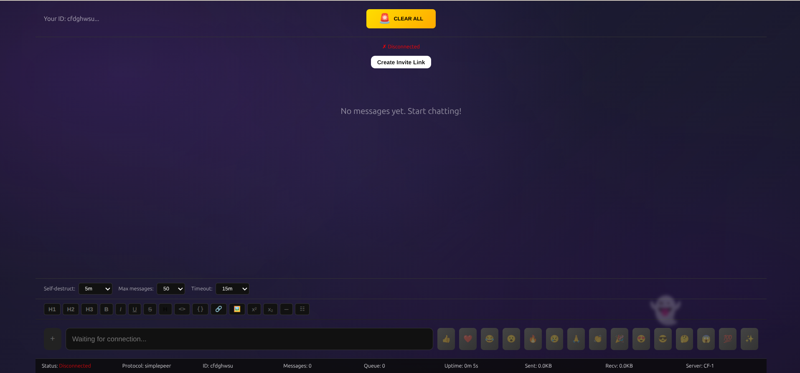

<div align="center">

# 👻 GhostChat

### Your messages vanish like ghosts

**True peer-to-peer chat where messages travel directly between users.**  
No servers storing or reading your conversations. Everything exists only in memory and disappears when you close the tab.

[](LICENSE)
[](https://nextjs.org)
[](https://webrtc.org)
[](CONTRIBUTING.md)

[Live Demo](https://ghost-chat.pages.dev) • [Documentation](#documentation) • [Contributing](CONTRIBUTING.md) • [Changelog](CHANGELOG.md)

</div>

---

## 📸 Screenshots

<div align="center">

### Landing Page


### Chat Interface


### Copy Invite Link


</div>

---

## 🎯 Why GhostChat?

Most "secure" messaging apps still store your messages on servers. Even Signal and WhatsApp keep metadata. **GhostChat is different:**

- ✅ **True P2P** - Messages travel directly between users via WebRTC
- ✅ **Zero server storage** - No databases, no logs, no message history
- ✅ **Memory-only** - Everything stored in RAM, wiped on tab close
- ✅ **No accounts** - No phone numbers, emails, or persistent identity
- ✅ **Self-destructing** - Messages auto-delete after 5s, 30s, 1m, or 5m
- ✅ **Open source** - Fully auditable code (MIT license)

**Perfect for:** Journalists, whistleblowers, activists, lawyers, executives, or anyone who values true privacy.

---

## ✨ Features

### 🔒 Privacy & Security

- **Direct P2P connections** - Messages never touch servers
- **E2E encryption** - WebRTC native DTLS/SRTP
- **Memory-only storage** - Zero disk traces, no forensics possible
- **Ephemeral identity** - Random peer ID per session
- **Auto-clear on close** - All data wiped when tab closes
- **Connection fingerprint** - 4-emoji hash to verify no MITM
- **Sensitive content blur** - Auto-detect and blur passwords, SSN, credit cards
- **Metadata stripping** - Remove EXIF data from images
- **Anti-forensics** - Memory overwrite on message delete

### 💬 Messaging

- **Self-destructing messages** - Timer: 5s, 30s, 1m, 5m, or never
- **Message deletion** - Delete for both sides with P2P sync
- **Read receipts** - Single/double checkmark delivery status
- **Typing indicators** - See when peer is typing
- **Markdown support** - 16 formatting buttons (bold, italic, code, etc.)
- **Quick emojis** - 15 one-click emoji buttons
- **Message search** - Real-time filtering with highlighting
- **Copy protection** - Clipboard auto-clears after 10 seconds

### 📁 File Sharing

- **P2P file transfer** - Send files up to 10MB directly
- **Chunked transfer** - Reliable transmission via 64KB chunks
- **Upload progress** - Real-time progress bar
- **Image preview** - Inline display for images
- **Metadata stripping** - EXIF removal from images

### 🚨 Emergency Features

- **Panic button** - Clear all messages instantly (Ctrl+Shift+X)
- **Message limit** - Auto-cleanup (10, 25, 50, or 100 messages)
- **Session timeout** - Auto-disconnect after inactivity (5m-1h)
- **Screen blur** - Auto-blur on tab switch or idle

### 🌐 Infrastructure

- **$0 operating costs** - Cloudflare Workers signaling (200k requests/day)
- **Automatic fallback** - Worker 1 → Worker 2 → PeerJS backup
- **PWA support** - Installable as desktop/mobile app
- **No tracking** - Zero analytics, telemetry, or user data collection

---

## 🚀 Quick Start

### For Users

**1. Visit the app:**

```
https://ghost-chat.pages.dev
```

**2. Create a room:**

- Click "Start Chatting"
- Click "Create Room"
- Copy the invite link

**3. Share with peer:**

- Send invite link via text, email, or any channel
- Peer clicks link and connects automatically

**4. Chat privately:**

- Messages travel directly between you (P2P)
- Close tab when done - everything vanishes

### For Developers

**Clone and run locally:**

```bash
# Clone repository
git clone https://github.com/teycir/ghostchat.git
cd ghostchat

# Install dependencies
npm install

# Run development server
npm run dev

# Open http://localhost:3000
```

**Test P2P locally:**

```bash
# Terminal 1
npm run dev

# Browser Tab 1: localhost:3000/chat
# Click "Create Room" → Copy invite link

# Browser Tab 2: Paste invite link
# Messages sync via WebRTC P2P
```

**Build for production:**

```bash
npm run build
npm start

# Or deploy static export
npm run build
# Upload /out directory to any static host
```

---

## 🏗️ Architecture

### How P2P Works

```
User A                    Signaling Server              User B
  |                              |                         |
  |------ Create Room ---------->|                         |
  |<----- Peer ID: abc123 -------|                         |
  |                              |                         |
  |                              |<----- Join: abc123 -----|
  |<---- WebRTC Offer -----------|------ Forward Offer --->|
  |<---- ICE Candidates ---------|------ Forward ICE ----->|
  |                              |                         |
  |<========== Direct P2P Connection ===================>|
  |                              |                         |
  |-- "Hello!" ------------------------------------------>|
  |<----------------------------------------- "Hi!" ------|
  |                              |                         |
  (Signaling server no longer involved)
```

**Key Points:**

1. Signaling server only helps establish connection (WebRTC SDP exchange)
2. Once connected, messages flow directly peer-to-peer
3. Server never sees message content
4. Connection uses WebRTC DataChannels (DTLS encrypted)

### Tech Stack

- **Frontend:** Next.js 15, React, TypeScript
- **P2P Protocol:** simple-peer (primary), PeerJS (fallback)
- **Signaling:** Cloudflare Workers (self-hosted)
- **Styling:** CSS-in-JS (no external CSS frameworks)
- **Storage:** Memory-only (no localStorage/IndexedDB)
- **Deployment:** Static export (Cloudflare Pages, Vercel, Netlify)

### Project Structure

```
ghostchat/
├── app/                    # Next.js App Router
│   ├── page.tsx           # Landing page
│   ├── chat/page.tsx      # Chat page
│   └── globals.css        # Global styles
├── components/            # React components
│   ├── ChatCore.tsx       # Main chat logic
│   ├── MessageList.tsx    # Message rendering
│   └── ...
├── lib/                   # Core libraries
│   ├── peer-manager.ts    # P2P connection manager
│   ├── storage.ts         # Memory-only storage
│   ├── file-transfer.ts   # Chunked file transfer
│   └── ...
├── public/                # Static assets
│   ├── manifest.json      # PWA manifest
│   └── sw.js             # Service worker
└── tests/                 # Test suite
```

---

## 🔐 Security

### Threat Model

**What GhostChat protects against:**

- ✅ Server-side data breaches (no server storage)
- ✅ Message interception (E2E encrypted)
- ✅ Forensic analysis (memory-only, no disk traces)
- ✅ Persistent surveillance (ephemeral sessions)
- ✅ Metadata collection (no accounts, minimal logs)

**What GhostChat does NOT protect against:**

- ❌ Compromised devices (keyloggers, screen capture)
- ❌ Man-in-the-middle attacks (verify fingerprint!)
- ❌ IP address exposure (peers see each other's IPs - use VPN)
- ❌ Browser vulnerabilities (keep browser updated)

### Man-in-the-Middle (MITM) Attack Vectors

GhostChat is vulnerable to MITM attacks during the initial connection phase. Here's how:

**1. Signaling Server Compromise**
- The Cloudflare Worker facilitates WebRTC handshake (SDP exchange)
- A compromised signaling server could intercept and modify:
  - Session Description Protocol (SDP) offers/answers
  - ICE candidates (connection endpoints)
  - Encryption keys during negotiation
- Result: Attacker establishes two separate connections (A↔Attacker↔B)

**2. Invite Link Interception**
- Invite links contain the peer ID: `https://ghost-chat.pages.dev/chat?peer=abc123`
- If shared via insecure channel (SMS, unencrypted email, public chat):
  - Attacker intercepts link and connects first
  - Original recipient connects to attacker instead of intended peer
- Result: Both parties unknowingly chat with the attacker

**3. Network-Level Attack**
- Attacker on same WiFi/network can:
  - Perform DNS spoofing to redirect traffic
  - Intercept WebRTC negotiation packets
  - Inject malicious ICE candidates
- Result: Traffic routed through attacker's machine

### MITM Protection: Connection Fingerprint

GhostChat includes a **connection fingerprint** system to detect MITM attacks:

```
🔴🟢🔵🟡  ← 4-emoji hash
123456     ← 6-digit verification code
```

**How it works:**
1. Both peers generate a deterministic hash from their peer IDs
2. Hash is displayed as 4 emojis + 6-digit code
3. **If connection is direct:** Both see IDENTICAL fingerprint
4. **If MITM present:** Each sees DIFFERENT fingerprint (because attacker has different peer ID)

**Example:**
```
Direct Connection:
  Alice sees: 🔴🟢🔵🟡 (hash of Alice+Bob)
  Bob sees:   🔴🟢🔵🟡 (hash of Alice+Bob) ✅ MATCH

MITM Attack:
  Alice sees: 🔴🟢🔵🟡 (hash of Alice+Attacker)
  Bob sees:   🟣🟠⚫🔶 (hash of Bob+Attacker) ❌ MISMATCH
```

### Security Best Practices

**CRITICAL: Always verify fingerprint out-of-band**

1. **Verify connection fingerprint** - Compare 4-emoji hash via separate channel:
   - Phone call (read emojis aloud)
   - Video call (show screen)
   - In-person verification
   - Signal/WhatsApp message (different channel than invite link)
   - **DO NOT** verify via the same channel you shared the invite link

2. **Share invite links securely**
   - Use end-to-end encrypted messaging (Signal, WhatsApp)
   - Share in person (QR code scan)
   - Avoid SMS, email, public forums

3. **Use VPN** - Hide your IP address from peer and network observers

4. **Secure device** - Keep OS and browser updated

5. **Private browsing** - Use incognito/private mode

6. **Trusted network** - Avoid public WiFi without VPN

7. **Fresh session** - Create new room for each conversation (don't reuse peer IDs)

### Security Audits

- [ ] Independent security audit (planned)
- [ ] Penetration testing (planned)
- [ ] Bug bounty program (planned)

**Found a vulnerability?** Please report responsibly to [teycir@pxdmail.net](mailto:teycir@pxdmail.net)

---

## 📊 Comparison

| Feature              | GhostChat | Signal      | WhatsApp    | Telegram    |
| -------------------- | --------- | ----------- | ----------- | ----------- |
| **True P2P**         | ✅ Yes    | ❌ No       | ❌ No       | ❌ No       |
| **Server storage**   | ❌ None   | ✅ Metadata | ✅ Metadata | ✅ Messages |
| **Requires account** | ❌ No     | ✅ Phone    | ✅ Phone    | ✅ Phone    |
| **Message history**  | ❌ None   | ✅ Yes      | ✅ Yes      | ✅ Yes      |
| **Self-destruct**    | ✅ Yes    | ✅ Yes      | ❌ No       | ✅ Yes      |
| **Open source**      | ✅ Yes    | ✅ Yes      | ❌ No       | ❌ Partial  |
| **Cost**             | 💰 Free   | 💰 Free     | 💰 Free     | 💰 Free     |

---

## 🛠️ Development

### Prerequisites

- Node.js 18+
- npm or yarn
- Modern browser with WebRTC support

### Browser Compatibility

**Supported Browsers:**
- Chrome/Chromium (recommended)
- Firefox
- Edge
- Safari
- Brave (with shields down for this site)

**Not Compatible:**
- LibreWolf - WebRTC is disabled by default for privacy
- Tor Browser - WebRTC is blocked for anonymity
- Browsers with strict WebRTC blocking

**Note:** Privacy-focused browsers often disable WebRTC to prevent IP leaks. To use GhostChat with these browsers, you must enable WebRTC in settings (not recommended as it defeats their privacy purpose). Use mainstream browsers with a VPN instead

### Setup

```bash
# Install dependencies
npm install

# Run tests
npm test

# Run E2E tests
npm run test:e2e

# Lint code
npm run lint

# Type check
npm run type-check
```

### Environment Variables

```bash
# Optional: Custom PeerJS server
NEXT_PUBLIC_PEERJS_HOST=your-server.com
NEXT_PUBLIC_PEERJS_PORT=443
NEXT_PUBLIC_PEERJS_PATH=/myapp
```

### Contributing

We welcome contributions! Please see [CONTRIBUTING.md](CONTRIBUTING.md) for guidelines.

**Ways to contribute:**

- 🐛 Report bugs
- 💡 Suggest features
- 🔧 Submit pull requests
- 📖 Improve documentation
- 🌍 Add translations
- 🎨 Design improvements

---

## 🚢 Deployment

### Cloudflare Pages (Recommended)

```bash
npm run build
wrangler pages deploy out
```

### Vercel

```bash
npm run build
vercel --prod
```

### Self-Hosted

```bash
npm run build
# Upload /out directory to any static host
# Nginx, Apache, S3, etc.
```

### Docker

```bash
docker build -t ghostchat .
docker run -p 3000:3000 ghostchat
```

## 📄 License

MIT License - see [LICENSE](LICENSE) file for details.

**TL;DR:** Free to use, modify, and distribute. No warranty provided.

---

## ⚠️ Disclaimer

This project is shared for **educational purposes only**. Users are responsible for complying with all applicable laws and regulations. Do not use this tool for illegal activities. The developers assume no liability for misuse.

---

## 🙏 Acknowledgments

- [simple-peer](https://github.com/feross/simple-peer) - WebRTC library
- [PeerJS](https://peerjs.com) - Fallback P2P protocol
- [Next.js](https://nextjs.org) - React framework
- [Cloudflare Workers](https://workers.cloudflare.com) - Signaling infrastructure

---

## 💖 Support

If you find GhostChat useful, please:

- ⭐ Star this repository
- 🐦 Share on social media
- 💰 [Sponsor on GitHub](https://github.com/sponsors/teycir)
- ☕ [Buy me a coffee](https://buymeacoffee.com/teycir)

---

<div align="center">

**Built with ❤️ for privacy**

[Website](https://ghost-chat.pages.dev) • [GitHub](https://github.com/teycir/ghostchat) • [Twitter](https://twitter.com/ghostchatapp)

</div>
